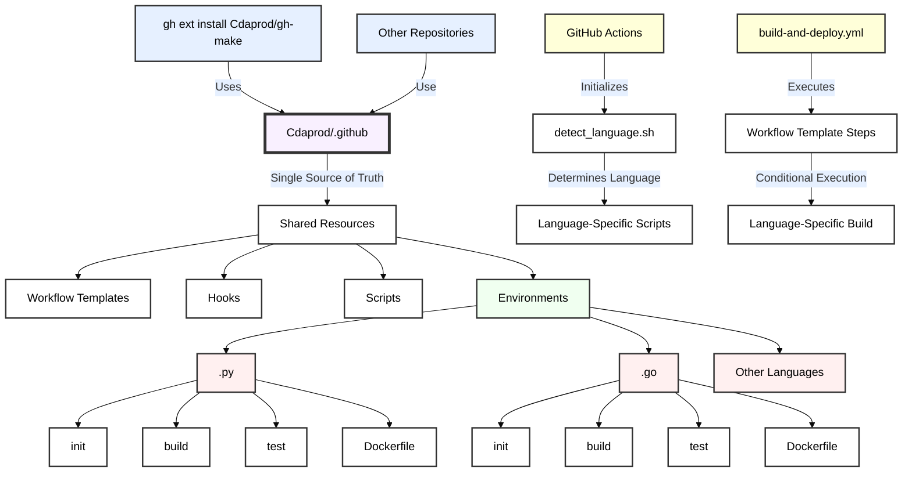

# David Cannan aka Cdaprod’s Git Hook System



### Single Source Of Truth

By using your `.github` repository as a single source of truth for shared workflows and hooks, you streamline the setup and maintenance process for all your repositories. This approach enhances consistency, reduces duplication, and simplifies the management of CI/CD processes across your projects. You can further automate the fetching and application of these resources with scripts and GitHub Actions workflows. This strategy is particularly effective for managing large-scale projects or organizations where uniformity and automation are key.

By creating a new `.github` repository and using it as your single source of truth for repositories like `git-make`, you are effectively centralizing your workflow configurations, scripts, and other automation tasks. This approach ensures consistency and simplifies the management of CI/CD processes across all your repositories. Here’s how to leverage your newly created `.github` repository effectively:

### Steps to Use the `.github` Repository as a Single Source of Truth

1. **Store Shared Resources in the `.github` Repository**:
   - Place all your GitHub Actions workflows, scripts, hooks, and other configurations in the appropriate directories within the `.github` repository.
   - For example:
 
     ```
     .github/
     ├── workflows/
     │   ├── build.yml
     │   └── deploy.yml
     ├── workflow-templates/
     │   ├── common-workflow.yml
     │   └── another-workflow.yml
     ├── hooks/
     │   ├── pre-commit
     │   └── post-merge
     └── README.md
     ```

2. **Set Up Your Repositories to Use the `.github` Remote**:
   - For each repository you want to configure with the `.github` repository's resources, add `.github` as an additional remote:
   ```bash
   git remote add github-config git@github.com:Cdaprod/.github.git
   ```

3. **Fetch and Apply Configurations**:
   - You can use the `git fetch` command to get the latest changes from `.github` and then use `git checkout` or `git merge` to apply the configurations to your local repository.
   ```bash
   git fetch github-config
   git checkout github-config/main -- .github/workflows
   ```

4. **Automate the Application of Configurations**:
   - You can automate this process with a script or a Git hook that runs every time changes are fetched or merged. This will ensure that the configurations are always up to date.

5. **Example of Automating Hook Setup**:
   - Create a simple shell script in each repository to automate the setup:
 
   ```bash
   # setup-hooks.sh

   # Add .github as a remote if it's not already present
   git remote | grep 'github-config' || git remote add github-config git@github.com:Cdaprod/.github.git

   # Fetch the latest hooks
   git fetch github-config

   # Checkout the hooks
   git checkout github-config/main -- .github/hooks

   # Make hooks executable
   chmod +x .github/hooks/*

   # Copy hooks to the .git/hooks directory
   cp .github/hooks/* .git/hooks/

   echo "Hooks setup complete."
   ```

   - Run this script once in each repository to set up the hooks automatically:
 
   ```bash
   bash setup-hooks.sh
   ```

6. **Use Workflow Templates Across Repositories**:
   - Each repository can reference workflow templates stored in the `.github` repository using the `uses` keyword in GitHub Actions workflows:
 
   ```yaml
   name: Build and Test

   on:
     push:
       branches:
         - main

   jobs:
     build:
       uses: Cdaprod/.github/.github/workflow-templates/common-workflow.yml@main
   ```

### Advantages of Using the `.github` Repository

- **Centralization**: Maintain all shared workflows, hooks, and configurations in one place.
- **Consistency**: Ensure all repositories follow the same processes, reducing configuration drift.
- **Ease of Maintenance**: Updates made in the `.github` repository propagate to all repositories that reference it.
- **Simplification**: Reduces the need for repetitive setup and configuration across multiple repositories.

---

## Available Scripts and Hooks in the `.github` Repository

The `.github` repository serves as a centralized location for shared GitHub Actions workflows, Git hooks, and utility scripts. This repository is designed to standardize and automate processes across all repositories in the organization, ensuring consistency and efficiency.

### Scripts

1. **`setup-hooks.sh`**:  
   This script sets up Git hooks in a local repository. It adds `.github` as a remote, fetches the latest hooks from the `.github` repository, checks them out, and copies them to the local `.git/hooks` directory.

   **Usage**:  
   Run this script in any local repository to set up Git hooks automatically.  
 
   ```bash
   bash setup-hooks.sh
   ```

2. **`pull-git-hooks.sh`**:  
   This script pulls the latest changes from the remote repository and copies the Git hooks from `.github/hooks` to the local `.git/hooks` directory.

   **Usage**:  
   Automatically run as part of the `post-merge` hook or manually executed to refresh hooks.  
 
   ```bash
   bash pull-git-hooks.sh
   ```

### Git Hooks

1. **`pre-commit`**:  
   This hook runs checks before a commit is finalized. It is commonly used for linting code, checking for security issues, or ensuring code formatting standards are met.

2. **`pre-push`**:  
   Runs checks before pushing changes to a remote repository. This hook can enforce additional validation, such as running test suites or ensuring specific criteria are met.

3. **`post-merge`**:  
   This hook runs after a merge operation. It can be used to update dependencies, regenerate files, or perform cleanup tasks.

### Example Workflow: Setting Up Hooks in a New Repository

To ensure all repositories have consistent Git hooks and workflows, use the following example workflow, which utilizes the `setup-hooks.sh` script to initialize hooks:

**`.github/workflows/init-hooks.yml`**

```yaml
name: Initialize Git Hooks

on:
  push:
    branches:
      - main

jobs:
  setup-hooks:
    runs-on: ubuntu-latest

    steps:
      - name: Checkout repository
        uses: actions/checkout@v2

      - name: Set up GitHub CLI
        run: |
          sudo apt-get install gh
          gh auth login --with-token ${{ secrets.GITHUB_TOKEN }}

      - name: Add .github remote
        run: git remote add github-config git@github.com:Cdaprod/.github.git

      - name: Fetch and apply hooks
        run: |
          git fetch github-config
          git checkout github-config/main -- .github/hooks
          chmod +x .github/hooks/*
          cp .github/hooks/* .git/hooks/
          echo "Git hooks have been set up successfully."

      - name: Run setup-hooks script
        run: bash setup-hooks.sh
```

### How to Use This Workflow

1. **Trigger the Workflow**: This workflow can be triggered automatically when changes are pushed to the main branch or manually via GitHub Actions.
2. **Setup Git Hooks**: It will fetch the latest hooks from the `.github` repository, apply them to the local `.git/hooks` directory, and ensure they are executable.
3. **Consistency Across Repositories**: All repositories that utilize this workflow will have consistent Git hooks, reducing manual setup and ensuring adherence to organizational standards.

### Streamlining Processes with Autonomy

The `.github` repository is a powerful tool for managing shared workflows, scripts, and hooks across all repositories in your organization. By utilizing these scripts and hooks, you can streamline processes, enforce consistency, and automate routine tasks, making development more efficient and standardized.

This will help developers understand the purpose of each script and hook, and how to use them effectively across their repositories.

## gh-make GitHub CLI Extension

The `gh-make` extension is a powerful tool that extends the functionality of the GitHub CLI (`gh`) to manage hooks, scripts, and repository indexing across multiple projects.

### Installation

To install the `gh-make` extension, follow these steps:

1. Ensure you have the GitHub CLI (`gh`) installed and authenticated.
2. Run the following command to install the extension:

   ```bash
   gh extension install Cdaprod/gh-make
   ```
   
#### Setup Permissions
   
1. Save the `gh-make-setup-script` content in a file named `gh-make-setup-script` in your extension directory.
2. Update the main `gh-make` script with the content from the second artifact.
3. Make both scripts executable:
   ```bash
   chmod +x ~/.local/share/gh/extensions/gh-make/gh-make
   chmod +x ~/.local/share/gh/extensions/gh-make/gh-make-setup-script
   ```
4. To run the setup, use:
   ```bash
   gh make setup
   ```
   This will create and run a setup script with sudo, using the full path to the `gh` command.
5. After setup, you can use the extension normally:
   ```bash
   gh make
   ```

This approach should solve the issue with sudo not finding the `gh` command, while still allowing for proper setup of permissions and directories. The setup process is now handled by a separate script that's run with sudo, while the main extension can be run without sudo after initial setup.

### Usage

Once installed, you can use the `gh-make` extension with the following commands:

```bash
gh make <command>
```

Available commands:

- `install-hooks`: Install hooks into all repositories
- `install-scripts`: Install shared scripts into all repositories
- `index-repos`: Index Git repositories and add them to GitHub Project
- `setup`: Run setup script to install hooks
- `clean`: Clean up the script and docker templates from repositories
- `all`: Run all commands (except clean)

### Configuration

The `gh-make` extension uses the following environment variables for configuration:

- `GH_MAKE_REPOS_DIR`: Directory containing your repositories (default: `/path/to/your/repos`)
- `GH_MAKE_HOOKS_DIR`: Directory containing hook templates (default: `$HOME/.github/hooks`)
- `GH_MAKE_SCRIPTS_DIR`: Directory containing shared scripts (default: `$HOME/.github/scripts`)

You can set these variables in your shell profile or before running the `gh make` command:

```bash
export GH_MAKE_REPOS_DIR="/custom/path/to/repos"
gh make install-hooks
```

### Examples

1. Install hooks in all repositories:
 
   ```bash
   gh make install-hooks
   ```

2. Install shared scripts across all repositories:
 
   ```bash
   gh make install-scripts
   ```

3. Index repositories and add them to a GitHub Project:
 
   ```bash
   gh make index-repos
   ```

4. Run all tasks (install hooks, install scripts, setup, and index repos):
 
   ```bash
   gh make all
   ```

5. Clean up installed scripts from all repositories:
 
   ```bash
   gh make clean
   ```

### Contributing

Contributions to the `gh-make` extension are welcome! Please submit issues and pull requests to the [Cdaprod/gh-make](https://github.com/Cdaprod/gh-make) repository.

### License

This project is licensed under the MIT License - see the [LICENSE](LICENSE) file for details.


