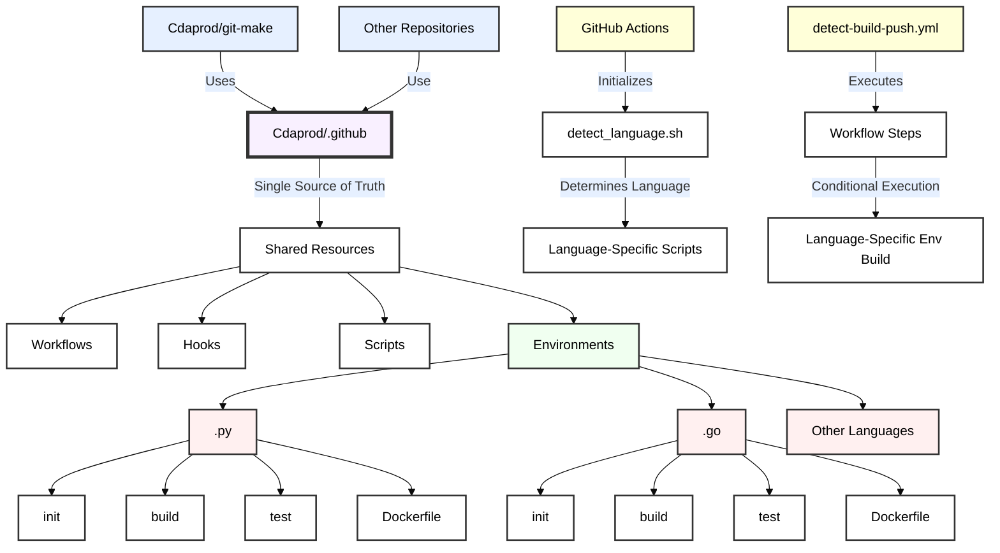

```mermaid
%%{init: {'theme': 'base', 'themeVariables': { 'primaryColor': '#f9f0ff', 'secondaryColor': '#e6f0ff', 'tertiaryColor': '#f0fff0', 'quaternaryColor': '#fff0f0', 'quinaryColor': '#ffffd9'}}}%%
graph TD
    A[Cdaprod/.github] -->|Single Source of Truth| B[Shared Resources]
    B --> C[Workflows]
    B --> D[Hooks]
    B --> E[Scripts]
    B --> F[Environments]
    
    F --> G[.py]
    F --> H[.go]
    F --> I[Other Languages]
    
    G --> J[init]
    G --> K[build]
    G --> L[test]
    G --> M[Dockerfile]
    
    H --> N[init]
    H --> O[build]
    H --> P[test]
    H --> Q[Dockerfile]
    
    R[Cdaprod/git-make] -->|Uses| A
    S[Other Repositories] -->|Use| A
    
    T[GitHub Actions] -->|Initializes| U[detect_language.sh]
    U -->|Determines Language| V[Language-Specific Scripts]
    
    W[detect-build-push.yml] -->|Executes| X[Workflow Steps]
    X -->|Conditional Execution| Y[Language-Specific Env Build]
    
    style A fill:#f9f0ff,stroke:#333,stroke-width:4px
    style R fill:#e6f0ff,stroke:#333,stroke-width:2px
    style S fill:#e6f0ff,stroke:#333,stroke-width:2px
    style F fill:#f0fff0,stroke:#333,stroke-width:2px
    style G fill:#fff0f0,stroke:#333,stroke-width:2px
    style H fill:#fff0f0,stroke:#333,stroke-width:2px
    style I fill:#fff0f0,stroke:#333,stroke-width:2px
    style T fill:#ffffd9,stroke:#333,stroke-width:2px
    style W fill:#ffffd9,stroke:#333,stroke-width:2px
    
    classDef default fill:#fff,stroke:#333,stroke-width:2px;
    classDef darkText color:#000;
    class A,B,C,D,E,F,G,H,I,J,K,L,M,N,O,P,Q,R,S,T,U,V,W,X,Y darkText;
```  